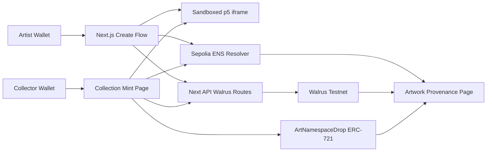

# Architecture

## Data Flow

1. Artist uploads or loads a p5.js-compatible package.
2. The browser validates the package and renders deterministic previews in a sandboxed iframe.
3. The extracted algorithm bundle is uploaded to Walrus.
4. Collection text records are written to the pre-created ENS collection name.
5. Collector renders the next deterministic output.
6. Params, render, NFT metadata, and provenance manifest are uploaded to Walrus.
7. The ERC-721 is minted with the metadata URI and uniqueness hash.
8. Artwork text records are written to the pre-created ENS artwork name.
9. The provenance page reads ENS and Walrus records back live.

## ENS Mode

The MVP uses `precreated` ENS mode. The app writes records to existing names that the demo wallet controls. This keeps the live demo focused on real resolver operations without risking subname registrar complexity during the hackathon.
